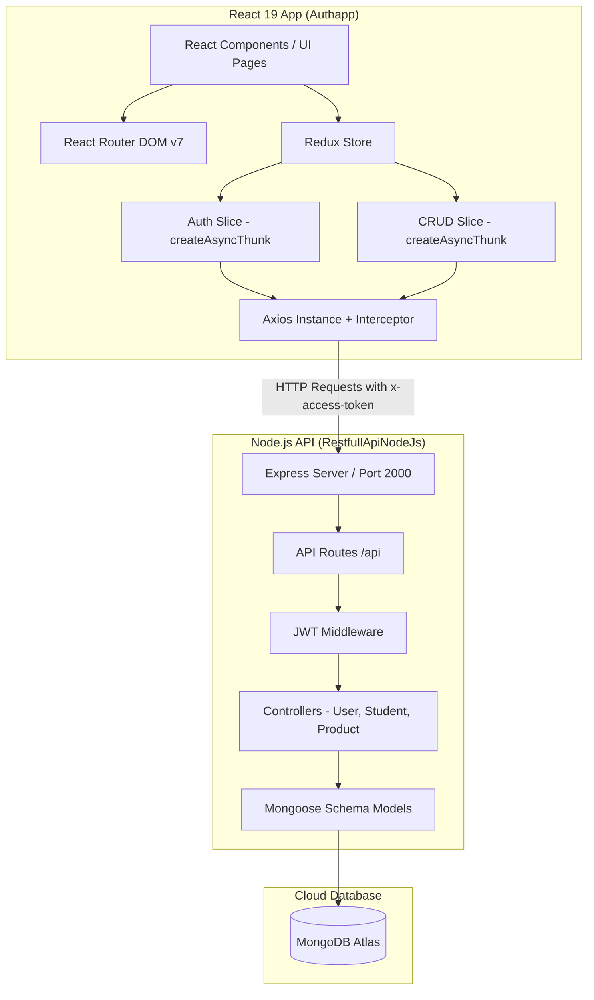

# Full-Stack Authentication & CRUD Management System


A modern, production-grade full-stack web application built with **React 19**, **TypeScript**, **Redux Toolkit**, **Tailwind CSS v4**, **Node.js**, **Express**, and **MongoDB**. 

This repository features a complete user authentication pipeline (JWT-based login, registration, password updates, password reset flow), protected client-side routes, global state management via Redux Toolkit (`createAsyncThunk`), and full CRUD operations for data management backed by a RESTful API.

---

## 📋 Table of Contents

- [Features](#-features)
- [Anti-Gravity Background Animation](#-anti-gravity-background-animation)
- [Tech Stack](#-tech-stack)
- [Project Architecture](#-project-architecture)
- [Directory Structure](#-directory-structure)
- [API Endpoints](#-api-endpoints)
- [Getting Started](#-getting-started)
  - [Prerequisites](#prerequisites)
  - [Backend Setup](#1-backend-setup-restfullapinodejs)
  - [Frontend Setup](#2-frontend-setup-authapp)
- [State Management Flow](#-state-management-flow)
- [Contributing](#-contributing)
- [License](#-license)

---

## ✨ Features

### 🔐 Authentication & Authorization
- **User Registration & Login**: Account creation with password hashing via `bcryptjs` and token-based authentication.
- **JWT Authorization**: Custom Axios request interceptors automatically attaching `x-access-token` headers.
- **Password Management**: Update existing passwords and initiate password resets via token links (`Nodemailer`).
- **Protected Routing**: Navigation guards ensuring secure access to authenticated routes.
- **Persistent Sessions**: Automated token and user session persistence stored in `localStorage`/`sessionStorage`.

### ⚡ Data & CRUD Operations
- **Full CRUD Support**: Create, Read, Update, and Delete operations for resources (Students / Products).
- **Asynchronous State Handling**: Powered by Redux Toolkit's `createAsyncThunk` with loading, idle, and error states.
- **Interactive UI Feedback**: Real-time notifications powered by `Sonner` toast notifications and `SweetAlert2` modal dialogs.
- **Image & File Uploads**: Middleware integration with `Multer` for handling multipart form data.

### 🎨 User Experience & Design
- **Responsive Layout**: Designed with **Tailwind CSS v4** for optimal layout adaptability across mobile, tablet, and desktop screens.
- **Modern Component Architecture**: Modular TypeScript components utilizing React 19 hooks and typed interfaces.
- **Google Anti-Gravity Cursor Physics Background**: High-performance full-screen HTML5 Canvas animation featuring single-color Electric Blue (`#3b82f6`) particles, inverse-distance anti-gravity mouse repulsion, kinetic velocity vector impulse transfer, anchor spring restoration, neural constellation link lines, and click shockwaves.

---

## 🌌 Anti-Gravity Background Animation

The application features a custom, high-performance HTML5 Canvas physics engine (`AntiGravityBackground.tsx`) rendered silently behind all pages (`fixed inset-0 z-30 pointer-events-none`).

### ⚙️ Vector Physics & Features
- **Monochrome Electric Blue Palette**: Styled with a single professional accent color (`#3b82f6` Electric Blue) for a clean, non-intrusive executive look.
- **Anti-Gravity Mouse Repulsion**: Cursor proximity exerts an inverse-square physics force ($F \propto (1 - d/R)^2$), smoothly deflecting nearby particles away.
- **Kinetic Velocity Impulse Transfer**: Rapid cursor sweeps transfer velocity vectors (`mouse.vx`, `mouse.vy`) to surrounding particles.
- **Anchor Spring Restoration**: Damped spring physics force ($F_{\text{spring}} = -k \Delta x$) gently restoring particles back to their floating base coordinates.
- **Neural Constellation Mesh**: Distance-based link lines (`0.75px`, `opacity: 0.16`) dynamically connecting nearby floating nodes within $115\text{px}$.
- **Radial Click Shockwaves**: Left-clicking anywhere on the screen emits an expanding radial energy pulse that displaces floating nodes with spring recoil.

---

## 🛠️ Tech Stack

| Domain | Technology / Library | Description |
| :--- | :--- | :--- |
| **Frontend Framework** | [React 19](https://react.dev/) | UI library with TypeScript support |
| **Build Tool** | [Vite 8](https://vitejs.dev/) | Next-generation fast frontend tooling |
| **State Management** | [Redux Toolkit](https://redux-toolkit.js.org/) + [React Redux](https://react-redux.js.org/) | Global store with async thunks (`authSlice`, `crudSlice`) |
| **Canvas Physics Engine** | HTML5 Canvas + Physics Vector Math | Custom single-color Anti-Gravity cursor animation (`AntiGravityBackground.tsx`) |
| **Styling** | [Tailwind CSS v4](https://tailwindcss.com/) | Modern utility-first CSS framework |
| **Routing** | [React Router DOM v7](https://reactrouter.com/) | Declarative client-side routing |
| **HTTP Client** | [Axios](https://axios-http.com/) | Promise-based HTTP client with request interceptors |
| **UI Components & Alerts** | [Sonner](https://sonner.emilkowal.si/) & [SweetAlert2](https://sweetalert2.github.io/) | Toast notifications and custom alert dialogs |
| **Backend Runtime** | [Node.js](https://nodejs.org/) & [Express.js](https://expressjs.com/) | RESTful API web server framework |
| **Database** | [MongoDB](https://www.mongodb.com/) & [Mongoose](https://mongoosejs.com/) | NoSQL database and Object Data Modeling (ODM) |
| **Security & Auth** | [JSON Web Tokens (JWT)](https://jwt.io/) & [Bcryptjs](https://github.com/dcodeIO/bcrypt.js) | Token authentication and password hashing |
| **File Handling** | [Multer](https://github.com/expressjs/multer) | Middleware for handling file and image uploads |
| **Email Service** | [Nodemailer](https://nodemailer.com/) | Email dispatcher for password recovery |

---

## 🏗️ Project Architecture



---

## 📁 Directory Structure

```plaintext
Redux pr/
├── Authapp/                          # React + TypeScript + Vite Frontend App
│   ├── public/                       # Static public assets
│   ├── src/
│   │   ├── api/                      # Axios configuration & API endpoint maps
│   │   │   ├── axiosInstance.ts      # Axios client with JWT request interceptor
│   │   │   └── endPoints.ts          # Centralized API endpoint URLs
│   │   ├── component/                # Feature-based UI components
│   │   │   ├── about/                # About page component
│   │   │   ├── allStudents/          # Student listing and grid display
│   │   │   ├── contact/              # Contact form component
│   │   │   ├── createStudent/        # Add new student / product form
│   │   │   ├── forget/               # Password reset request component
│   │   │   ├── home/                 # Landing page / dashboard view
│   │   │   ├── login/                # User login form
│   │   │   ├── missionVision/        # Mission & vision presentation component
│   │   │   ├── register/             # User registration form
│   │   │   ├── sweetAlert.tsx        # Custom SweetAlert modal helpers
│   │   │   ├── updatePassword/       # Password updating form
│   │   │   └── updateStudent/        # Edit existing student record form
│   │   ├── layout/                   # Global page wrappers
│   │   │   ├── header.tsx            # Dynamic navigation bar with auth status
│   │   │   ├── footer.tsx            # Global site footer
│   │   │   └── rootLayout.tsx        # App layout container
│   │   ├── redux/                    # Redux Toolkit state management
│   │   │   ├── authslice.ts          # Auth state, login/register thunks & reducers
│   │   │   ├── crudSlice.ts          # CRUD state, student/product thunks
│   │   │   └── store.ts              # Redux root store configuration
│   │   ├── Route/                    # Application routing
│   │   │   └── route.tsx             # React Router route definitions
│   │   ├── types/                    # TypeScript interfaces & types
│   │   │   └── type.ts               # Core data contracts for auth and CRUD
│   │   ├── App.tsx                   # Main React application component
│   │   ├── App.css                   # Component-level styles
│   │   ├── index.css                 # Global CSS & Tailwind CSS directives
│   │   └── main.tsx                  # React DOM entry point & Redux Provider
│   ├── eslint.config.js              # ESLint configuration
│   ├── index.html                    # Single Page Application HTML root
│   ├── package.json                  # Frontend dependencies & npm scripts
│   ├── tsconfig.json                 # TypeScript compiler setup
│   └── vite.config.ts                # Vite bundler configuration
│
└── RestfullApiNodeJs/                # Node.js + Express Backend Server
    ├── config/                       # Configuration helpers (DB & auth)
    ├── controller/                   # Business logic and request handlers
    │   ├── userController.js         # User registration, login, reset handling
    │   ├── StudentController.js      # Student CRUD logic
    │   ├── ProductController.js      # Product management logic
    │   ├── StoreController.js        # Store handling logic
    │   ├── categoryController.js     # Category management logic
    │   ├── SubcategoryController.js  # Subcategory management logic
    │   ├── FeedbackController.js     # User feedback handling logic
    │   └── admin/                    # Admin panel controllers
    ├── middleware/                   # Express custom middleware (Auth token verification)
    ├── model/                        # Mongoose data schemas
    │   ├── userModel.js              # User schema definition
    │   ├── Student.js                # Student schema definition
    │   ├── productModel.js           # Product schema definition
    │   ├── Store.js                  # Store schema definition
    │   ├── category.js               # Category schema definition
    │   ├── subcategory.js            # Subcategory schema definition
    │   └── feedbackModel.js          # Feedback schema definition
    ├── public/                       # Static uploaded files and assets
    ├── route/                        # Express API route modules
    │   ├── userRoute.js              # /api user auth endpoints
    │   ├── web.js                    # Student CRUD routes
    │   ├── productRoute.js           # Product routes
    │   ├── storeRoute.js             # Store routes
    │   ├── categoryRoute.js          # Category routes
    │   ├── subCategoryRoute.js       # Subcategory routes
    │   └── feedbackRoute.js          # Feedback routes
    ├── views/                        # EJS template views (for admin/email previews)
    ├── Procfile                      # Deployment configuration
    ├── package.json                  # Backend dependencies & npm scripts
    └── server.js                     # Express application entry point & DB connection
```

---

## 🔗 API Endpoints

### 🔐 Authentication Routes (`/api`)

| Method | Endpoint | Description | Auth Required |
| :--- | :--- | :--- | :---: |
| `POST` | `/api/register` | Register a new user | ❌ |
| `POST` | `/api/login` | Login user & return JWT token | ❌ |
| `POST` | `/api/update-password` | Update current password | 🔐 |
| `POST` | `/api/forget-password` | Request password reset token / email | ❌ |
| `GET` | `/api/dashboard` | Fetch protected user dashboard info | 🔐 |

### 📦 CRUD Routes (`/api`)

| Method | Endpoint | Description | Auth Required |
| :--- | :--- | :--- | :---: |
| `POST` | `/api/product/create` | Create a new student / product record | 🔐 |
| `GET` | `/api/product` | Fetch all records | ❌ |
| `GET` | `/api/product/:id` | Fetch single record details by ID | ❌ |
| `POST` | `/api/product/update/:id` | Update existing record by ID | 🔐 |
| `DELETE` | `/api/product/delete/:id` | Delete record by ID | 🔐 |

---

## 🚀 Getting Started

### Prerequisites

Ensure you have the following installed on your local machine:
- [Node.js](https://nodejs.org/) (`v18.0.0` or higher recommended)
- [npm](https://www.npmjs.com/) (`v9.0.0` or higher)
- [MongoDB](https://www.mongodb.com/) (Local instance or MongoDB Atlas account)

---

### 1. Backend Setup (`RestfullApiNodeJs`)

1. Open a terminal and navigate to the backend directory:
   ```bash
   cd RestfullApiNodeJs
   ```

2. Install dependencies:
   ```bash
   npm install
   ```

3. Configure Environment Variables / Database connection:
   - Ensure MongoDB connection URL is properly set in `server.js` or through environment configurations.

4. Start the backend server:
   ```bash
   npm start
   ```
   > The backend server will run on `http://localhost:2000` (or configured port).

---

### 2. Frontend Setup (`Authapp`)

1. Open a separate terminal window and navigate to the frontend directory:
   ```bash
   cd Authapp
   ```

2. Install dependencies:
   ```bash
   npm install
   ```

3. (Optional) Adjust API base URL:
   - Check `src/api/endPoints.ts` to set your target API server endpoint (`http://localhost:2000` or hosted API).

4. Start the Vite development server:
   ```bash
   npm run dev
   ```
   > The application will start locally at `http://localhost:5173`.

---

## ⚡ State Management Flow

1. **User Request**: Component triggers a dispatch call via `useAppDispatch()` (e.g., `dispatch(login(credentials))`).
2. **Async Action (`createAsyncThunk`)**: Redux Toolkit invokes the thunk, executing an HTTP call via `axiosInstance`.
3. **Interceptor Insertion**: Axios interceptor checks `localStorage`/`sessionStorage` and injects `x-access-token` header if available.
4. **Backend Processing**: Express routes process the request, verify credentials or JWT token via middleware, interact with MongoDB, and return a JSON payload.
5. **Redux Store Mutation**: Redux `extraReducers` captures the response (`fulfilled` or `rejected`), updates global slice state, and displays toast notifications using `Sonner`.
6. **UI Synchronization**: Subscribed React components re-render automatically via `useAppSelector()`.

---

## 🤝 Contributing

Contributions, issues, and feature requests are welcome! Feel free to check the issues page or submit pull requests.

1. Fork the repository
2. Create your feature branch (`git checkout -b feature/AmazingFeature`)
3. Commit your changes (`git commit -m 'Add some AmazingFeature'`)
4. Push to the branch (`git push origin feature/AmazingFeature`)
5. Open a Pull Request

---

## 📄 License

This project is licensed under the **ISC License**.

---

<p center="align">
  Crafted with ❤️ for building high-performance, secure React & Node.js applications.
</p>
